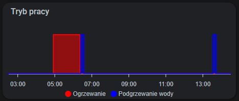
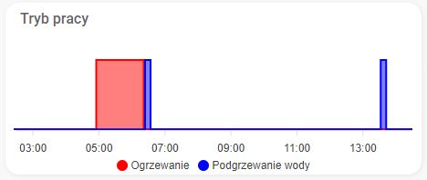

# Wykres różnych stanów jednego sensora

## Wygląd wykresu




## Opis

Powyższy wykres jest wizualną reprezentacją jednego sensora `sensor.boiler_current_mode`, który - w zależności od aktualnego trybu pracy boilera - przyjmuje stan  `Ogrzewanie`, `Podgrzewanie wody` lub `wyłączony`. Wykres przekształca te stany na wartości `0` (dla stanu `wyłączony`) lub `1` (dla stanów `Ogrzewanie`, `Podgrzewanie wody`) i reprezentuje je w rozbiciu na dwie serie danych.

## Wykorzystane karty

| Karta                                                             | Typ karty         | Źródło | Wersja |
|:------------------------------------------------------------------|:------------------|:-------|:-------|
| [apexcharts-card](https://github.com/RomRider/apexcharts-card)    | `custom`          | `HACS` |`1.8.1` |

## Konfiguracja

```yaml
type: custom:apexcharts-card
graph_span: 12h
header:
  show: true
  title: Tryb pracy
apex_config:
  grid:
    show: false
  chart:
    height: "100%"
  tooltip:
    enabled: true
  yaxis:
    show: false
all_series_config:
  type: area
  curve: stepline
  stroke_width: 2
  opacity: 0.5
  show:
    legend_value: false
series:
  - entity: sensor.boiler_current_mode
    name: Ogrzewanie
    color: red
    transform: "return x === 'Ogrzewanie' ? 1 : 0;"
  - entity: sensor.boiler_current_mode
    name: Podgrzewanie wody
    color: blue
    transform: "return x === 'Podgrzewanie wody' ? 1 : 0;"
```
## Dodatkowe informacje

* Więcej przykładów konfiguracji `apex_config` można znaleźć bezpośrednio w [dokumentacji apexcharts](https://apexcharts.com/docs/options/)