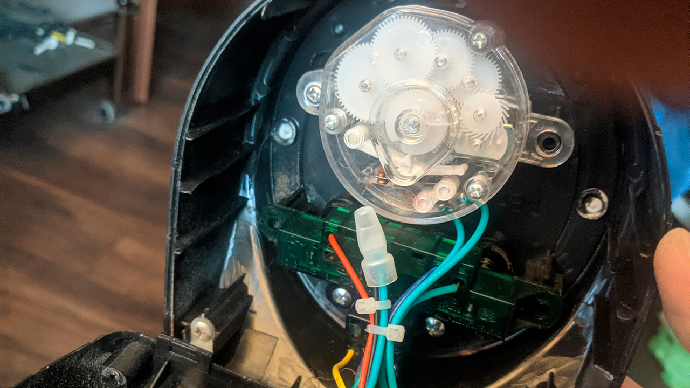
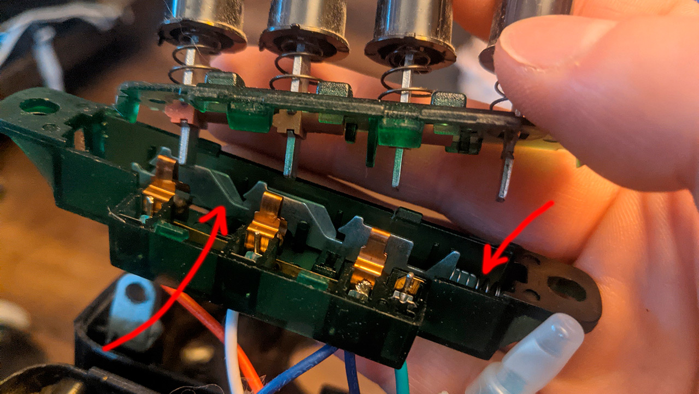
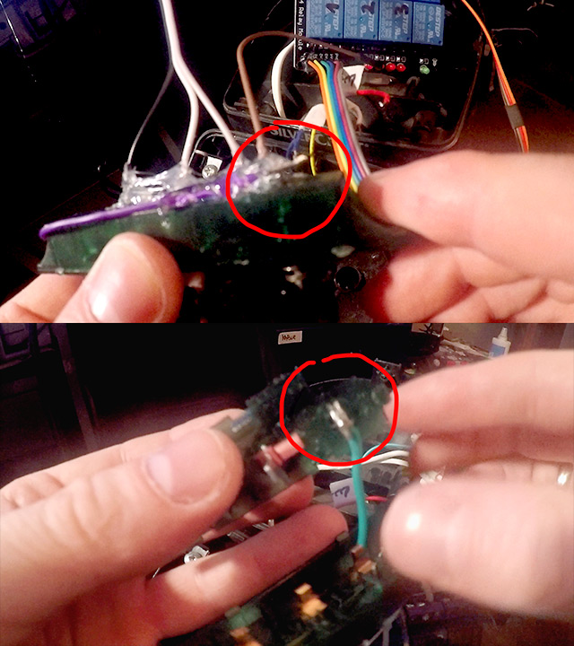
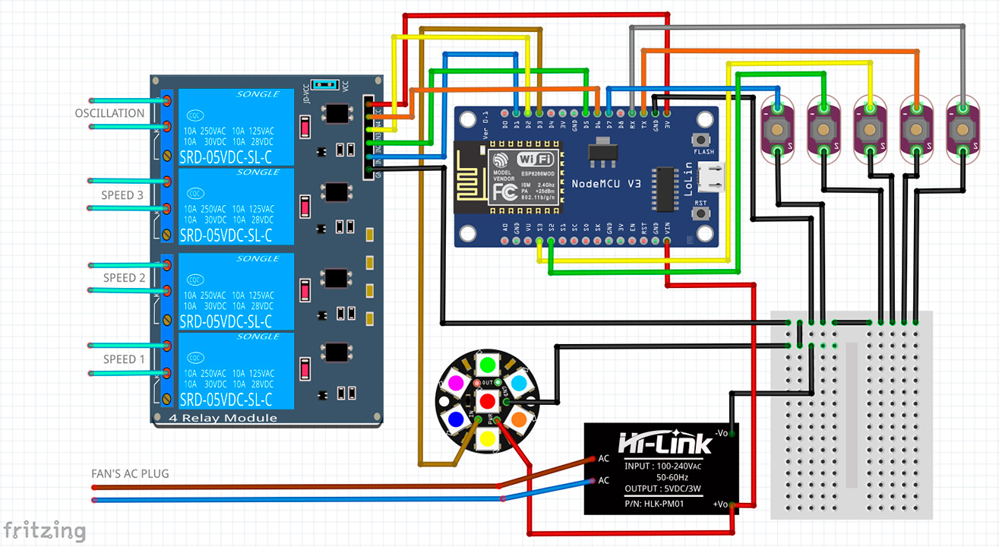
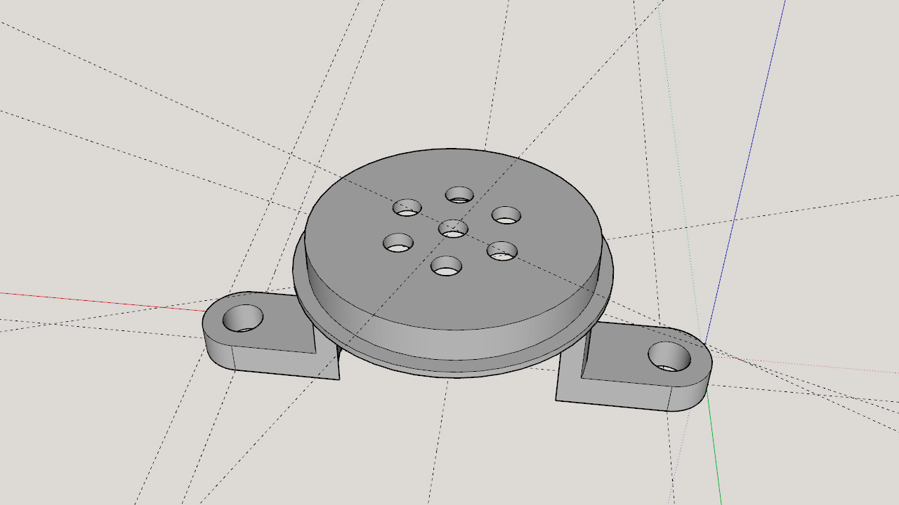
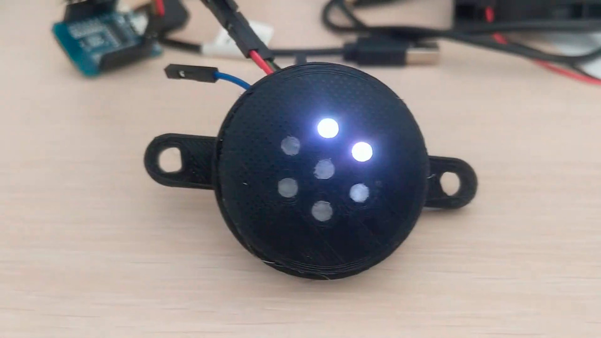
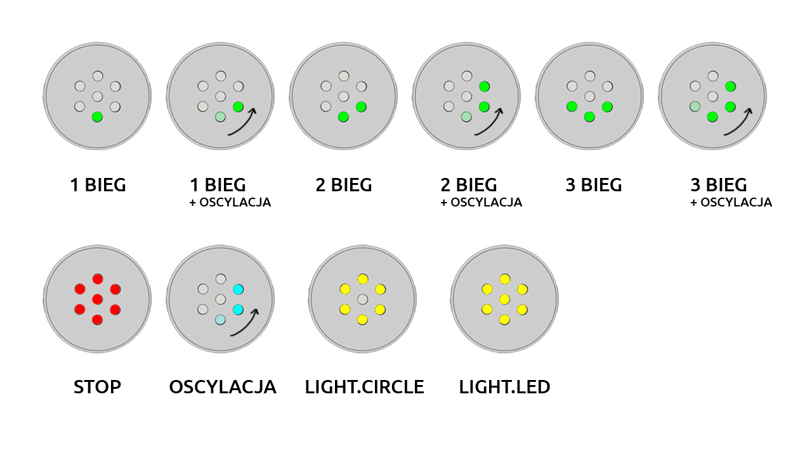

# Smart-wentylator z regulacją prędkości

Poniżej kilka słów o tym, jak usmartowić wentylator kolumnowy z Lidla - lub każdy inny, który będzie miał podobną zasadę działania, dlatego nie będzie to dokładna instrukcja krok-po-kroku, a raczej krótki opis najważniejszych działań. Wasze urządzenia mogą się różnić budową czy wykorzystanymi rozwiązanmiami, niekoniecznie da się zastosować moją metodę 1:1, ale koncept będzie podobny.

> **UWAGA! na tapecie mamy sprzęt elektryczny, więc zalecana szczególna ostrożność i przede wszystkim rozbieranie/rozbudowa wentylatora ODŁĄCZONEGO od gniazdka - niby o tym wiadomo, ale wolę przypomnieć.**

## Pacjent
Wentylator [Silvercrest z Lidla](https://www.lidl.pl/p/silvercrest-wentylator-kolumnowy-3-poziomowy-z-timerem-50-w/p100351400), 3-prędkości, timer ("kuchenny", mechaniczny), możliwość włączenia oscylacji, bez pilota, obsługiwany jak w XX wieku - ręcznie.

## Sprzęt

Poza w/w wentylatorem, do modyfikacji przydadzą się:

| Urządzenia                                                                                                            | Ilość |
|:----------------------------------------------------------------------------------------------------------------------|:------|
| płytka [NodeMCU](https://botland.com.pl/moduly-wifi-esp8266/4450-modul-wifi-esp-12e-nodemcu-v2-4mb-5903351241328.html)   | 1     |
| zasilacz [5V HI-LINK HLK-PM01](https://botland.com.pl/zasilacze-montazowe/10929-zasilacz-hi-link-hlk-pm01-100v-240vac-5vdc-06a-5904422317102.html)                                  | 1     |
| [przekaźnik 4-kanałowy 10A/250VAC](https://botland.com.pl/przekazniki-przekazniki-arduino/2579-modul-przekaznikow-4-kanaly-z-optoizolacja-styki-10a-250vac-cewka-5v-5904422330996.html) zasilany z 5V | 1 |
| krążek ledowy [HW-159 WS2812](https://botland.com.pl/lancuchy-i-matryce-led/2945-neopixel-jewel-pierscien-led-rgb-7xws2812-5050-adafruit-2226-5904422373511.html) | 1 |
| kable, kabelki, łączniki | N+1 |

Ja wykorzystałem wymienione powyżej sprzęty - ale oczywiście możliwe są ich modyfikacje - wykorzystanie innego ESP, innego zasilacza, mniejszego przekaźnika czy większego paska LED. Wszystko zależy od konkretnego przypadku i inwencji twórczej.

## Opis
Panel sterowania zlokalizowany był na górze wentylatora, dostępu do wnętrza broniły 3 śruby - jedna na plecach wentylatora i dwie wewnątrz, widoczne po lekkim uchyleniu obudowy (miejsce wkręcenia jednej z nich widoczna w lewym dolnym rogu fotki, a idąc dalej w prawo widać połowę metalowego kątownika z kolejną śrubą - ta konstrukcja trzymała z dwóch stron górną obudowę). W zależności od modelu warto się dokładnie wszystkiemu przyjrzeć, by niepotrzebnie nie wyłamywać jakiegoś zaczepu.

Zaraz po tym jak się dobrałem do klamotów pod górną obudową, okazało się, że przyciski mają prostą konstrukcję, z której wystarczy wyciągnąć blaszki i sprężynkę będące blokadami i przełączające prędkości na przemian - tak by uniemożliwić wciśnięcie 2 przycisków na raz (prędkości po wciśnięciu blokowały się, przycisk stop "wypychał" wszystko i wyłączał przepływ prądu).

Po zdjęciu blokad przyciski stały się włącznikami monostabilnymi - dają sygnał tylko w trakcie przyciśnięcia. Przeróbki wymagał wyłącznik, który niestety z niczym się nie stykał, a jedynie wypychał resztę - dorobiłem więc własne styki, dolutowując/doklejając dwa kabelki - jeden do blaszki/trzpienia, na którym osadzony jest przycisk, drugi pod obudową, tak by dociśnięcie spowodowało połączenie kabelków (łącznikiem stał się wspomniany trzpień, który po wciśnięciu wysuwa się z obudowy).

*Wybaczcie jakość jakby zdjęcie było robione ziemniakiem, nie skupiłem się na kamerce w trakcie pracy więc ostrość poszła w diabły...*

Włącznik oscylacji, mimo że osadzony osobno, miał ten sam mechanizm co biegi, więc wystarczyło usunąć blokadę i także "przerobił się" na mono.

Do przycisków doprowadzone były kable, którymi w skrócie mówiąc płynie prąd z gniazdka i tym samym bezpośrednio sterowały prędkościami/oscylacją - ich wciśnięcie zamykało dany obwód i wentylator działał zgodnie z włączonymi opcjami. Okazało się, że kable są osadzone "na wcisk", wystarczyło je tylko wyciągnąć i zamocować w przekaźnikach. Na ich miejsce wjechały przewody łącznikowe z goldpinami z jednej strony (wpasowały się pięknie w zaciski panelu sterowania) i łącznikami na piny z drugiej (w sam raz do połączenia z pinami na NodeMCU[1](#przypis1)).

Żeby zasilić płytkę z ESP dobrałem się do dolnej części wentylatora - przeciąłem kabel zasilający i rozgałęziłem go kostką łączeniową - z jednej strony szedł tam gdzie wcześniej (zasilanie elementów wentylatora plus góra obudowy - oryginalne przyciski wcześniej, a teraz już moje przekaźniki), z drugiej - poprowadziłem kable do zasilacza 5V. Okazało się, że przez cały słupek, od dołu do góry, prowadzi zgrabny tunelik, w którym szły oryginalne kable - zabezpieczone tym samym przed uszkodzeniem przez płaty wirnika - mój zasilający dołączył do nich i tym samym kostkę zasilacza mogłem zamontować w górnej części, razem z całym sterowaniem.

*Przyciski na schemacie - od lewej strony kolejno: bieg 1, bieg 2, bieg 3, oscylacja, wyłącznik.*

Żeby mieć więcej miejsca - wybebeszyłem mechaniczny timer (i tak nie miałby zastosowania + NIGDY go nie użyłem), po którym została spora dziura w obudowie. Idealne miejsce na sygnalizację opcji 😉 szybkie zwymiarowanie, "parę chwil" w sketchupie, druk i zaślepka gotowa. Otwory dodatkowo zapchałem półprzejrzystym klejem na gorąco, który robi za idealny dyfuzor do znajdującego się pod zaślepką krążka z LEDami.

Wsad (który wkleję na koniec) przygotowałem w ESPHome, chciałem w nim wykorzystać natywny komponent **fan** z platformą **speed** ale na razie się nie powiodło. Liczba prędkości zawsze wychodziła mi *N+1*, przełączanie między biegami nie działało dobrze, więc ostatecznie zrezygnowałem i zrobiłem to oparte na liście prędkości do wyboru.

LEDy - sygnalizują przez moment wybraną opcję (obojętnie czy ręcznie, czy zdalnie przez WWW czy HA), po czym gasną żeby niepotrzebnie nie oświetlać pomieszczenia. Pierwszy bieg to 1 LED, dwa biegi to 2 LEDy itd. Jeśli aktywna jest oscylacja - ledy zamiast migać w miejscu, robią dwa kółka i gasną. Stop świeci na czerwono. Dodatkowo wystawiłem sobie same ledy jako dwa światła - *"led"* (cały krążek) i *"circle"* (sam pierścień, bez środkowego leda). Dzięki temu mogę je potem wykorzystać w HA np. do powiadamiania (w planie podpięcie cyklicznego info o stanie powietrza, powiadomienie o dzwonku do drzwi itd.).

W samym HA - ponieważ z ESPHome nie udało się wystawić encji **fan** tak jak chciałem - zrobiłem **template fan**, który z grubsza ogarnia temat (ale to chyba pozostanie w ciągłej wersji *work in progress,* bo nie jest do końca tak jak chciałem/myślałem, chwilowo działa częściowo i generuje błędy). Wsad z esphome wystawia w razie wu także **switch**a do sterowania oscylacją i listę **select** z wyborem prędkości (wybór opcji *"stop",* działa jak przycisk stop, wyłącza całość), więc działa nawet bez tworzenia encji wentylatora.

Całość ma dość wysoki *WAF* (zresztą to żona pomysł przeróbki podrzuciła i kibicowała też w trakcie prac) - więc modyfikację polecam!

## Konfiguracja

* esphome/[1_lvn_ventilator.yaml](1_lvn_ventilator.yaml)

A ponieważ w ESPHome powtarzalne rzeczy mam zorganizowane w paczkach, w/w kod wymaga dwóch poniższych:

* esphome/\_includes/[esphome_wifi.yaml](esphome_wifi.yaml)
* esphome/\_includes/[esphome_base.yaml](esphome_base.yaml)

A na koniec opcjonalny i *prawie poprawny* [konfig template fan](template_fan.yaml) do użycia w HomeAssistant.

---

1
Pierwotnie użyłem WemosD1Mini ale szybko zastąpiłem go NodeMCU po tym, jak mnie oświecono, iż piny, z których skorzystałem są aktywne w trakcie bootowania układu, co skutkowało chwilowym przełączaniem przekaźników - warto brać to pod uwagę, żeby zniwelować niepotrzebne "cykanie" na starcie i nie ryzykować np. włączeniem kilku prędkości na raz.
