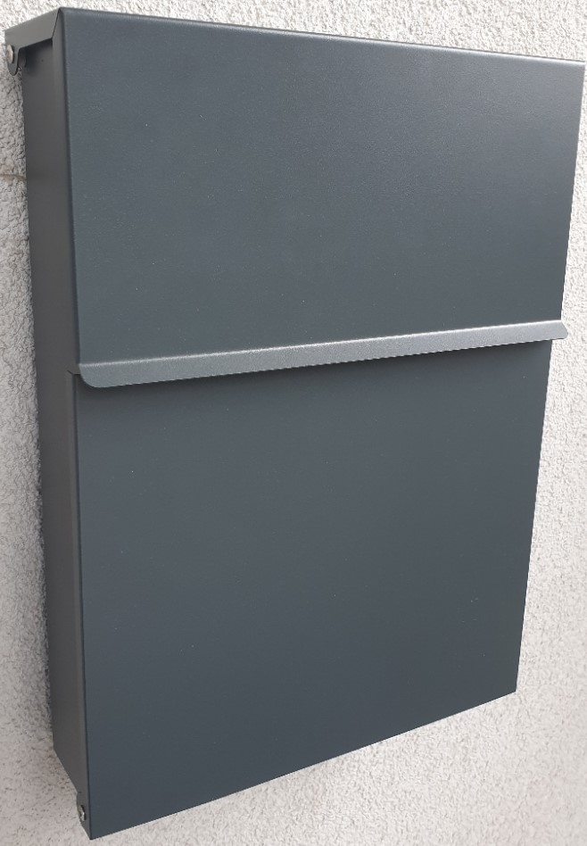
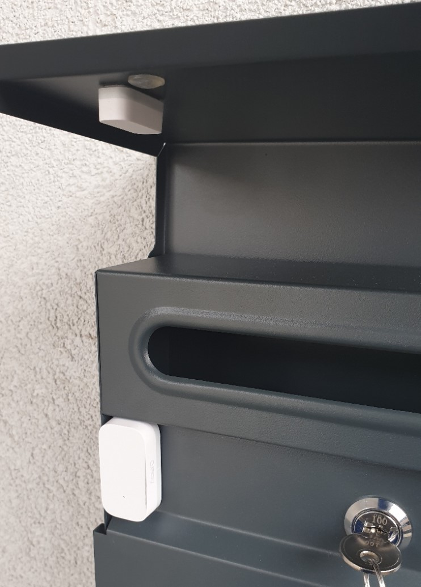
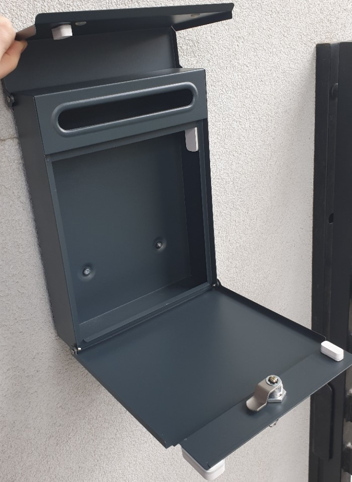
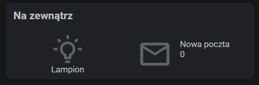
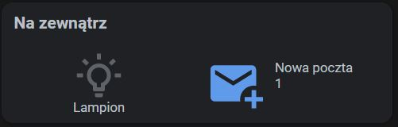
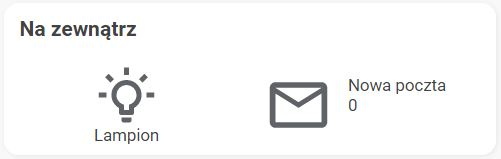
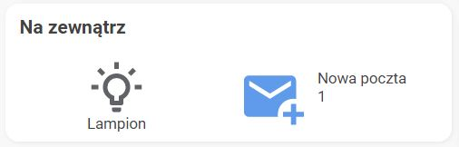

# Skrzynka na listy

## Opis
Daleki jestem od mówienia, że zrobiłem sobie *smart* skrzynkę na listy, zatem napiszę tylko tyle, że przy użyciu 2 kontaktronów zintegrowałem ją z HA. Poniższy setup pozwala przede wszystkim na:
* wykrywanie otwarcia wrzutni
* wykrywanie otwarcia skrzynki w celu wyjęcia poczty

Funkcjonalności, które dzięki temu stworzyłem to:
* powiadomienia o nowej poczcie (w aplikacji mobilnej oraz jako `persistant_notification`)
* zliczanie ilości otwarć wrzutni
* wyświetlanie w UI statusu wraz z ilością otwarć wrzutni
* możliwość resetowania licznika z UI

## Sprzęt

Do projektu wykorzystałem poniższy sprzęt:

| Urządzenia                                                                                                            | Ilość |
|:----------------------------------------------------------------------------------------------------------------------|:------|
| [Skrzynka na listy PAULA-M](https://allegro.pl/oferta/skrzynka-na-listy-pocztowa-3-kolory-zakryty-zamek-8718454244)   | 1     |
| [Aqara Door and Window Sensor](https://www.aqara.com/us/door_and_window_sensor.html)                                  | 2     |

Czujniki Aqara zintegrowane mam poprzez [Conbee II](../../sprzet/rodzaje/Bramki-ZigBee.md#conbee2) + deConz.

## Montaż
Kilka zdjęć poglądowych, w jaki sposób umiejscowiłem czujniki:




## Konfiguracja
Poniższa konfiguracja wykorzystuje dane z czujników Aqara zdefiniowanych kolejno jako `binary_sensor.skrzynka_pocztowa_wrzutnia` oraz `binary_sensor.skrzynka_pocztowa_odbior`. Warto zwrócić uwagę na fakt, że konstrukcja skrzynki wymaga otwarcia klapy wrzutni, aby móc otworzyć skrzynkę w celu odebrania poczty. Z tego względu to właśnie otwarcie wrzutni jest wyzwalaczem automatyzacji. Dalej automatyzacja po uruchomieniu czeka `10s` na kolejny wyzwalacz, którym jest otwarcie skrzynki. Jeśli skrzynka zostanie otwarta w ciągu tych `10s`, wówczas znaczy to, że poczta została wyjęta i uruchamiany jest `script.poczta_wyjeta`. W przeciwnym razie, po upływie `10s` uruchamiany jest `script.nowa_poczta`. Poniższe wpisy należy dodać do pliku `configuration.yaml`
:


```yaml
counter:
  nowa_poczta:
    name: Nowa poczta
    icon: mdi:counter
    initial: 0
    step: 1

script:
  nowa_poczta:
    alias: Nowa poczta
    mode: single
    sequence:
      - service: counter.increment
        entity_id: counter.nowa_poczta
      - service: persistent_notification.create
        data:
          notification_id: nowa_poczta
          title: Nowa poczta
          message: W skrzynce na listy prawdopodobnie pojawiła się nowa poczta.
      - service: notify.mobile_app_samsungs9
        data:
          message: W skrzynce na listy prawdopodobnie pojawiła się nowa poczta.
          data:
          ledColor: "#00FFD8"
          channel: Standard
          ttl: 0
          priority: high
      - service: notify.mobile_app_redmi_note_9_pro
        data:
          message: W skrzynce na listy prawdopodobnie pojawiła się nowa poczta.
          data:
          priority: high

  poczta_wyjeta:
    alias: Poczta wyjęta
    mode: single
    sequence:
      - service: counter.reset
        entity_id: counter.nowa_poczta
      - service: persistent_notification.dismiss
        data:
          notification_id: nowa_poczta

automation:
- alias: Otwarcie skrzynki na listy
  trigger:
    - platform: state
      entity_id: binary_sensor.skrzynka_pocztowa_wrzutnia
      to: "on"
  action:
    - wait_template: "{{ is_state('binary_sensor.skrzynka_pocztowa_odbior', 'on') }}"
      timeout: 10
    - choose:
        - conditions: "{{ not wait.completed }}"
          sequence:
            - service: script.nowa_poczta
      default:
        - service: script.poczta_wyjeta
```

## Konfiguracja UI

### Wygląd
Oto wygląd mojej karty. Używam u siebie motywów [Goolge Light Theme](https://github.com/JuanMTech/google_light_theme) oraz [Google Dark Theme](https://github.com/JuanMTech/google_dark_theme0)






### Wykorzystane karty

| Karta                                                                             | Typ karty | Źródło      | Wersja  |
|:----------------------------------------------------------------------------------|:----------|:------------|:--------|
| [Button Card](https://github.com/custom-cards/button-card)                        | `custom`  | `HACS`      | `3.4.2` |
| [Vertical Stack In Card](https://github.com/ofekashery/vertical-stack-in-card)    | `custom`  | `HACS`      | `0.4.0` |
| [Markdown](https://www.home-assistant.io/lovelace/markdown/)                      | `default` | `Lovelace`  | `n/a`   |
| [Horizontal Stack Card](https://www.home-assistant.io/lovelace/horizontal-stack/) | `default` | `Lovelace`  | `n/a`   |

### Konfiguracja

Na wstępie, w głównym folderze z konfiguracją HA należy utworzyć folder `button_templates`. W nim należy stworzyć plik `button_card_templates.yaml` z następującą zawartością:
```yaml
mail:
  icon: >
    [[[
      if(parseInt(entity.state) > 0){
        return "mdi:email-plus";
      }else{
        return "mdi:email-outline";
      }
    ]]]
  size: 70%
  show_name: true
  show_state: true
  show_label: false
  styles:
    card:
      - height: 100px
    grid:
      - grid-template-areas: '"i n" "i s"'
      - grid-template-columns: 40% 1fr
      - grid-template-rows: 1fr
    name:
      - justify-self: start
      - padding: 10px 0px 0px 0px
    icon:
      - color: >
          [[[
            if(parseInt(entity.state) > 0){
              return "var(--state-icon-active-color)";
            }else{
              return "var(--state-icon-color)";
            }
          ]]]
    state:
      - justify-self: start
      - padding: 0px 0px 30px 0px
  state:
    - value: "unavailable"
      styles:
        icon:
          - color: var(--disabled-text-color)
  tap_action:
    action: more-info

# Dołączam również szablon basic użyty w sąsiadującej karcie
basic:
  size: 50%
  color: var(--state-icon-active-color)
  styles:
    card:
      - height: 100px
  state:
    - value: "unavailable"
      styles:
        icon:
          - color: var(--app-header-background-color)
  hold_action:
    action: more-info
```

Następnie w pliku `ui-lovelace.yaml` należy dodać następujący wpis:
```yaml
button_card_templates: !include button_templates/button_card_templates.yaml
```

Poniżej konfiguracja **całej** karty. Całej, ponieważ szablon dostosowany jest pod wyświetlanie wraz z towarzyszącą kartą w tym samym wierszu. W innym przypadku należy zmodyfikować szablon. Więcej informacji na temat szablonów można znaleźć w [dokumentacji karty](https://github.com/custom-cards/button-card#templates-support).
```yaml
type: custom:vertical-stack-in-card
cards:
  - type: markdown
    content: >
      ## Na zewnątrz
  - type: horizontal-stack
    cards:
      - type: "custom:button-card"
        entity: switch.lampion_wejscie_relay
        template: basic
        name: Lampion
        icon: mdi:lightbulb-on-outline
      - type: "custom:button-card"
        entity: counter.nowa_poczta
        template: mail
        name: Nowa poczta
        hold_action:
          action: call-service
          service: script.poczta_wyjeta
```